# Mi proyecto personal: Emulador de Spectrum para ESP32

### David Crespo, marzo de 2021
__________________________

En mayo de 2020 un cliente (soy programador freelance) me pidió ayuda para evaluar un microcontrolador ESP32 que quería usar en su producto; ya estaba usando un PSOC para comunicación por Bluetooth y ahora necesitaba WiFi y mayor potencia.

Me entregó mi primera placa (una placa de desarrollo DevKit ESP32-WRoom) y empecé a investigar sus capacidades, a familiarizarme con el entorno de desarrollo, a compilar y flashear pruebas...

Y me pareció un cacharro potente dentro de sus limitaciones, así que me puse a investigar qué más cosas hacía la gente con él.

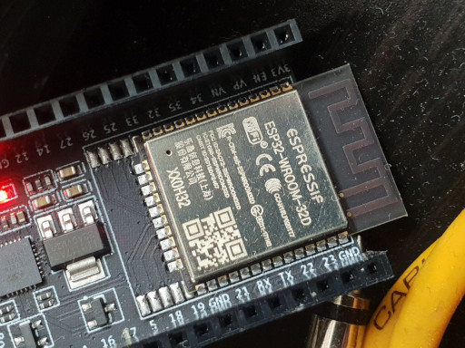

Lo primero que me llamó la atención (y mucho) fueron los trabajos de Bitluni ([https://bitluni.net/](https://bitluni.net/)), en los que conseguía utilizar el hardware programable para generar señal de vídeo.

Lo primero que probé fue una demo en la que genera señal de vídeo compuesto (en blanco y negro), así que flasheé mi ESP32 y la conecté a mi TV de 14" (el que uso para el Spectrum), y aluciné viendo una demo poligonal de una Venus de Milo en 3D.

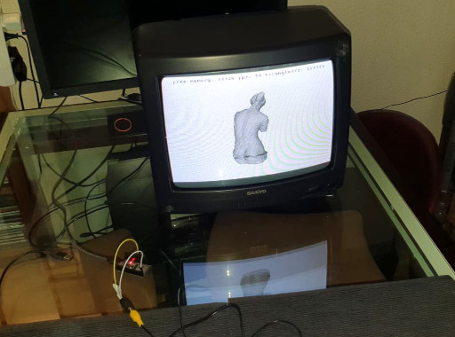

También tenía demos de vídeo compuesto en color, pero no eran estables. En algunas TV se veía en color, en otras no...

Después probé las demos de VGA, primero con color RGB digital (1 bit por componente de color R/G/B), conectando directamente el pin R al pin R del DSUB15, el G al G, el B al B, HSync a HSync y VSync a VSync.

En la página de github de Bitluni venía [un circuito](https://github.com/bitluni/ESP32Lib/blob/master/Documentation/schematic.png) para conseguir mayor profundidad de bits: crear un DAC R/2R con resistencias para conseguir el modo de más calidad de color disponible: R5G5B4, con 5 bits para rojo, 5 para verde y 4 para azul. Después de unas cuantas horas de soldador y pruebas de cableado y mapeo de pins, conseguí ver las demos de más calidad de color.

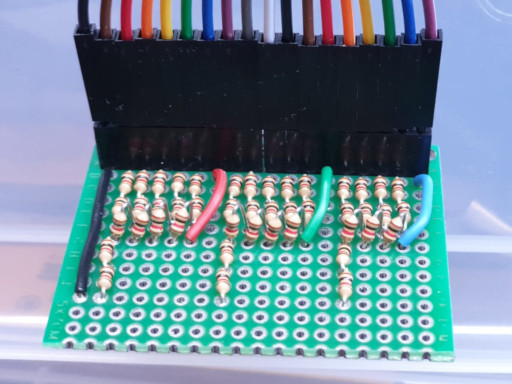

Modifiqué algunas demos para asegurarme de que el DAC funcionaba correctamente, y que si bien la rampa de luminancia no era perfectamente lineal, por lo menos era monótona creciente.

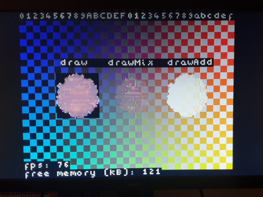

Estábamos en junio de 2020 y tenía un miniordenador que podía generar vídeo, pero nada más. Hice algunas demos, animaciones y cosas así, pero necesitaba algo más, conectarle algún periférico que sirviera de dispositivo de entrada. Hice algunas pruebas de conectarle pulsadores y cosas así, pensé en programar algún juego con pocos controles, fabricar algún tipo de mando...

... y entonces encontré una librería que me permitía leer el wiimote desde la ESP (la ESP32-Wiimote de bigw00d). Ya tenía un dispositivo de entrada.

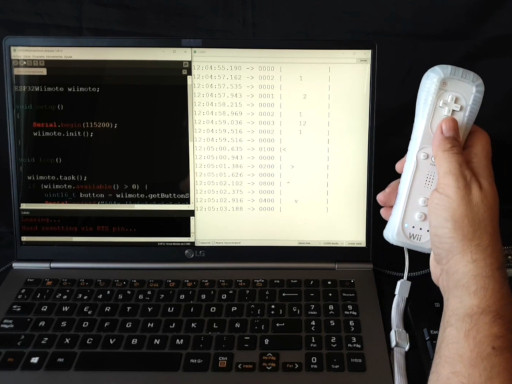

Entre tanto, compré más ESP32 (en concreto, el modelo ESP32-WRover que lleva 4Mb de PSRam).

Se me ocurrió entonces hacerme mi propio emulador de Spectrum (mi ordenador de la infancia, y el culpable de que trabaje de lo que trabajo). Pero antes de liarme la manta a la cabeza, volví a investigar, y encontré el emulador de Rampa (https://github.com/rampa069/ZX-ESPectrum), un emulador funcional. Lo flasheé y cargué el Manic Miner y funcionaba perfectamente, teniendo en cuenta que no tenía manera de controlarlo, pero el Manic Miner tiene un modo demo en el que va enseñando todas las pantallas y verlas en el monitor VGA me encantó.

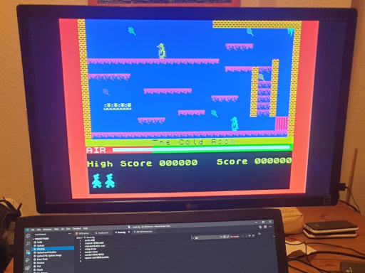

Se suponía que se podía conectar un teclado, pero entonces yo no sabía cómo. Hice una tentativa enganchando pines a pelo, pero no funcionó (luego supe por qué).

Así que decidí integrar el soporte para el mando de la Wii, que ya sabía que funcionaba, para poder manejar el emulador. Así que hice un fork del proyecto, y lo llamé ZX-ESPectrum-Wiimote.

En julio de 2020 conseguí hacer las modificaciones necesarias para que el emulador utilizara el mando de la Wii como dispositivo de entrada. Para ello, añadí junto a cada juego (ManicMiner.sna) un fichero de texto (ManicMiner.txt) que contenía el mapeo de los botones del Wiimote a teclas concretas, con un fichero de mapeo para cada juego. El wiimote tiene una cruceta y 7 botones utilizables, así que fue relativamente fácil hacer funcionar un montón de juegos.

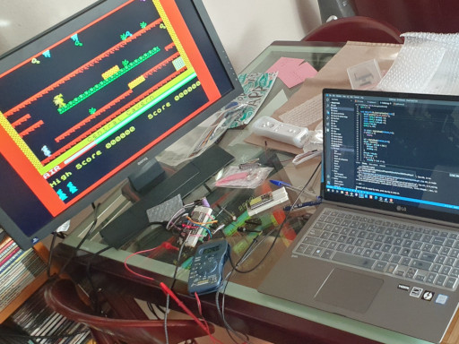

Todavía no había probado el teclado PS/2, así que traté de hacer mi modificación sin romper el soporte de teclado existente (que no tenía manera de probar). Hice un pull request al repo de Rampa, que lo incluyó en una rama aparte, porque no podía garantizarle que el teclado PS/2 seguía funcionando.

Empecé a hacer mis cambios en el emulador, al principio cosas menores como el tipo de letra (me programé un conversor para convertir un PNG que bajé de internet con el juego de caracteres), y modificando cosas en el menú.

Lo siguiente fue probar, por fin el teclado PS/2. Tenía un par de teclados antiguos PS/2 por casa, y me monté un convertidor bidireccional de niveles lógicos con transistores MOSFET en una placa de prototipo (en realidad hacen falta 2, una para la señal de reloj y otro para la de datos). 

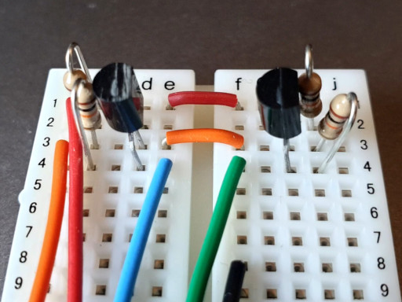

Conecté mi teclado PS/2 a los pines de la ESP32 y funcionó perfectamente, parece ser que al integrar el soporte de la Wii conseguí no romper nada.

El emulador era funcional, pero estaba montado en una placa de prototipo con todos los cables colgando y los componentes al aire, así que se me ocurrió volver a la esencia (el Spectrum) y montar todo el ordenador _dentro_ del teclado. Busqué por internet teclados PS/2 de tamaño mini y encontré uno (el Periboard 409 mini) en el que me pareció, según las fotos, que me iba a caber el ESP32 y el cableado por dentro, lo pedí y me llegó.

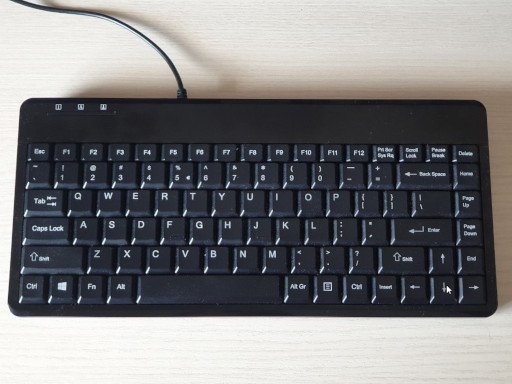

La decepción fue cuando lo conecté a los pines de la ESP y no funcionaba... no enviaba comandos al pulsar teclas. Pero el teclado funcionaba, conectado a un portátil antiguo, éste reconocía las pulsaciones sin problemas.

Investigando un poco más descubrí que durante el arranque de un teclado PS/2 los controladores de teclado envían una secuencia de inicialización, y el módulo PS2KBD del emulador de Rampa no lo hace. Encontré una librería (PS2KeyAdvanced de Paul Carpenter) que sí lo hacía, y la integré en el emulador. Sólo la utilizo para inicializar el teclado, pero con eso consigo que mi Periboard funcione.

En agosto de 2020 empecé a trabajar en el ESPectrum compacto. Si iba a caber, cabría muy justo en el hueco que hay en la parte trasera inferior que hace de peana para elevar el teclado... lo desmonté, y le quité todos los refuerzos de plástico en el interior para hacer hueco para la ESP32 Devkit que utilicé... y parece que cabría, doblándole las patas.

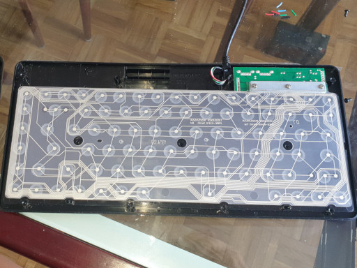

Por la posición de la ESP no podía exponer el conector microUSB hacia la trasera del teclado (no me cabía, así que tuve que pensar en un alargador). Como no me sentía capaz de soldar (por lo pequeño) un conector microUSB hembra, monté un USB tipo B hembra, pegándolo con superglue a la caja, y le soldé un trozo corto de cable que terminaba en un microUSB macho que enchufa en la ESP.

En cuanto a la VGA, decidí tirar por lo simple, y no poner DAC R/2R, conectando simplemente 6 cables de la ESP al VGA hembra: R, G, B, HSync, VSync y masa. Pegué unas bridas a la base del teclado con superglue, y entre las bridas y el superglue aseguré el conector VGA hembra.

Por simplicidad la señal VGA únicamente tiene 1 bit por componente de color, con lo que se pierde el modo BRIGHT del Spectrum (es similar a si el modo BRIGHT estuviera siempre a 1).

Lo último era montar en una placa en miniatura un doble convertidor bidireccional de niveles lógicos, lo que no conseguí a la primera, la primera placa no funcionó, pero lo conseguí a la segunda. Corté el cable del teclado PS/2, lo pelé y lo soldé a la placa convertidora, y funcionó.

Por último coloqué un jack de audio de 3.5mm, para tener salida de sonido. Comparado con todo lo anterior, ésto fue mucho más fácil.

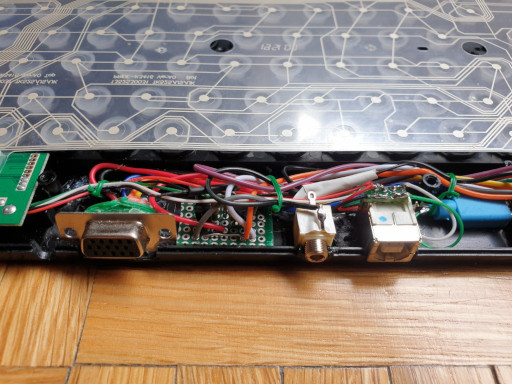

Ya tenía mi ESPectrum bien terminado, con todo su cableado oculto en el interior de un teclado mini, del que sólo asomaban tres conectores: VGA para salida de vídeo, jack de 3.5 para salida de audio, y USB-B para alimentación y programación. Me dió una gran satisfacción contemplar mi trabajo terminado. 

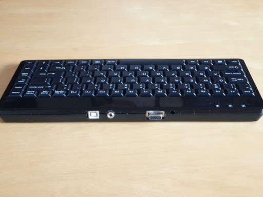

Así que me puse a trabajar en el firmware del emulador, y le añadí la funcionalidad de guardar y cargar snapshots en cualquier momento, para guardar partida antes de entrar en esa pantalla difícil del Jet Set Willy, y si caía en un bucle infinito de muertes, cargar partida.

Puse dos modalidades de snapshot: a memoria (más rápida) y a disco (más lenta, pero no se perdía al apagar la máquina).

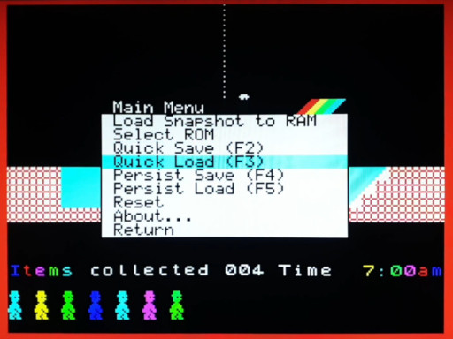

A finales de agosto de 2020 publiqué mi primer vídeo sobre el emulador ESPectrum:

[https://www.youtube.com/watch?v=ROthljwC5OA](https://www.youtube.com/watch?v=ROthljwC5OA)

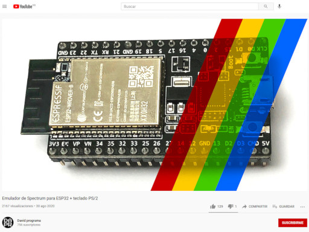

Revisando el about del repositorio de github del emulador de Rampa (del cual partí) ví que mencionaban "also for TTG VGA32". Investigué y ví que se referían a la Lilygo TTGo VGA32, una placa con todos los conectores ya soldados (PS/2 y VGA) y que salía por unos 10€.

En septiembre de 2020 me llegó y empecé a trastear con ella.

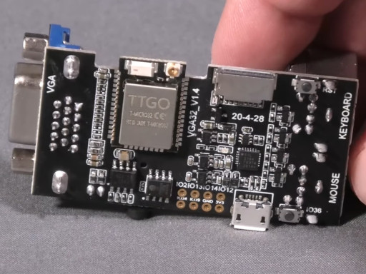

En realidad no hubo mucho que trastear, ya que prácticamente todo funcionó a la primera, sólo hubo que cambiar en el código del emulador los números de pin que usaba mi hardware por los que usaba la TTGO.

Eso sí, la TTGO lleva un convertidor D/A de resistencias R/2R de 2 bits por componente de color (RRGGBB), así que aproveché para integrar una nueva versión de la biblioteca de Bitluni, para usar el modo VGA6Bit, con lo que recuperé el atributo BRIGHT del Spectrum.

A principios de octubre de 2020 publiqué mi segundo vídeo sobre el emulador ESPectrum:

[https://www.youtube.com/watch?v=GXHBrQVTfBw](https://www.youtube.com/watch?v=GXHBrQVTfBw)

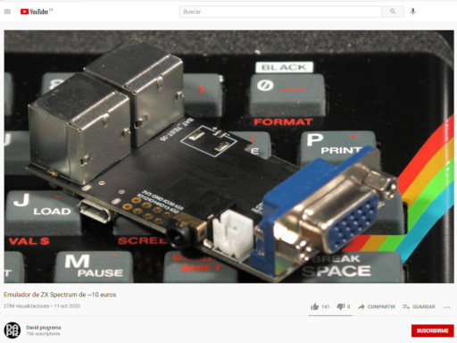

A través de los comentarios del vídeo me puse en contacto con Stormbytes1970 (Paco), con quién estuve hablando de la manera de conectar un teclado de Spectrum real (de 48 o 48+) a la ESP utilizando 13 pines GPIO.

La verdad es que Paco me abrió los ojos con este tema, yo lo había pensado con mentalidad de programador (leer periódicamente el estado del teclado y almacenarlo en un buffer), mientras que el tenía una mentalidad más electrónica, que consistía en interceptar las propias llamadas a "leer puerto" del Spectrum emulado, para por un lado escribir el número de puerto en los 8 pines de salida, y por otro lado leer el estado de los 5 pines de entrada.

Me pasó su código y tras unas cuantas pruebas lo integré en mi repositorio, como una opción más de configuración del emulador, que podía usarse o no cambiando #defines en un fichero de cabecera .h.

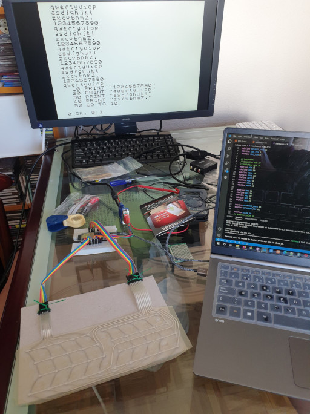

En noviembre de 2020 estuve investigando un detalle que no me gustaba del emulador: la temporización. En algunos juegos, la temporización era aproximadamente correcta. Pero el Manic Miner (mi juego preferido de Spectrum, dicho sea de paso), iba demasiado rápido en el emulador ESPectrum.

Ya había visto que la implementación de la contended memory en el emulador no estaba demasiado bien hecha. En su día la corregí, pero no fue suficiente. La contended memory es un mecanismo presente en los Spectrums, de modo que los accesos a los primeros 16Kb de memoria RAM (donde se aloja el framebuffer, la memoria gráfica) se ven penalizados en momentos concretos del ciclo de dibujo en pantalla. La ULA (el chip gráfico) tiene preferencia en el acceso a memoria, y si la CPU quiere acceder a esos primeros 16Kb de RAM, la ULA retrasa a la CPU introduciéndole ciclos de espera (parando la señal de reloj, una forma "creativa" de hacerlo).

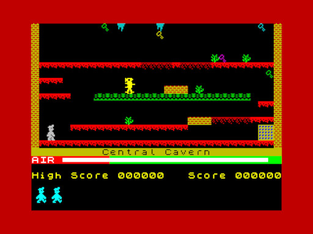

En otros juegos no se nota tanto, pero el Manic Miner consigue sus gráficos sin parpadeos dibujando el nivel y los personajes en un buffer off-screen que está en los primeros 16Kb de RAM, y luego lo copia a pantalla con la instrucción LDIR. Esta instrucción sufre muchos ciclos de espera cuando el buffer origen y destino están en los primeros 16Kb de RAM.

Así que implementé correctamente los ciclos de espera para las instrucciones LDIR, LDDR, CPIR y CPDR, no así para otras instrucciones, ya que las reglas para los ciclos de espera hay que implementarlas para cada instrucción, y yo me dí por satisfecho con que el Manic Miner funcionara a la velocidad correcta.

Con tanto probar el juego volví a tener ganas de jugarlo y estuve practicando hasta que fui capaz de terminar los 20 niveles sin vidas infinitas ni snapshots. Grabé un vídeo de la hazaña, realizada sobre un Spectrum 48K de teclas de goma, conectado a una TV de tubo, y cargando el juego desde cassette.

[https://www.youtube.com/watch?v=3qQsPtiP_nc](https://www.youtube.com/watch?v=3qQsPtiP_nc)

El juego terminado otra vez, pero viendo sólo pantalla:

[https://www.youtube.com/watch?v=uph2Q00jCfU](https://www.youtube.com/watch?v=uph2Q00jCfU)

Los siguientes meses no le dediqué tiempo al emulador ESPectrum. Tuve poco tiempo debido a una gran carga de trabajo.

A finales de febrero de 2021 volví a retomar el ESPectrum. Fabriqué unas carcasas con la impresora 3D para meter dentro las TTGo.

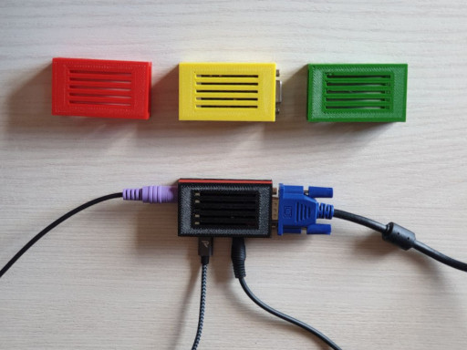

También compré un monitor VGA TFT de 17" (4:3) de segunda mano, barato (10€) y aproveché para añadir soporte para monitores 4:3, a resolución 320x240 (hasta ahora sólo soportaba monitores 16:9 a 360x200).

A petición de un usuario que comentó en uno de los vídeos, añadí soporte para tarjeta SD, lo que resultó muy fácil, debido a que la TTGo trae una ranura para tarjeta microSD. Fue sencillo de implementar, únicamente hubo que inicializar el soporte para SD, y luego sustituir en todas las llamadas de acceso a disco el objeto SPIFFS por el objeto SD. Se puede elegir entre uno u otro cambiando un #define en un fichero de cabecera.

En marzo de 2021 hice una reorganización del código, unificando las dos ramas (master y lilygo-ttgo-vga32), que aunque siguen siendo ramas distintas, comparten el 99.9% del código (sólo difiere la asignación de pines y poco más).

Con el código limpio y ordenado, añadí soporte para el formato de archivo .Z80, mucho más extendido que el formato .SNA que estaba usando hasta ahora. Conseguí soportar varias versiones de .Z80, para Spectrum 48K y 128K, además conmutando entre modos 48 y 128 en función del tipo de .Z80 que se está cargando, cosa que no hacían antes.

También añadí soporte parcial para el sonido del Spectrum 128K mediante una emulación incompleta del chip AY-3-8912. No suena exactamente igual que en un Spectrum, pero es similar (por lo menos el tono es exacto), y al menos los juegos de 128K tienen algo de sonido.

Continuará...

